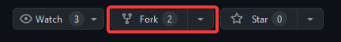
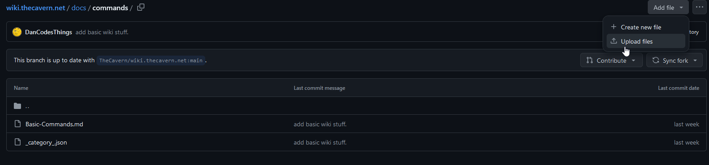
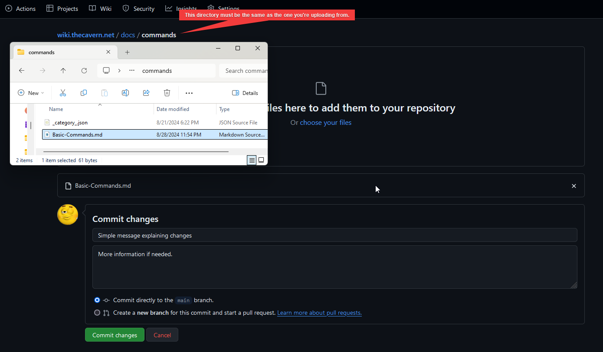
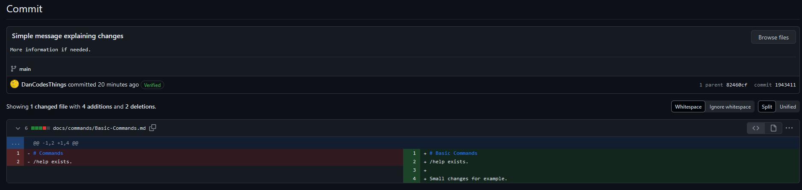
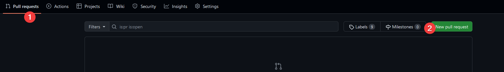
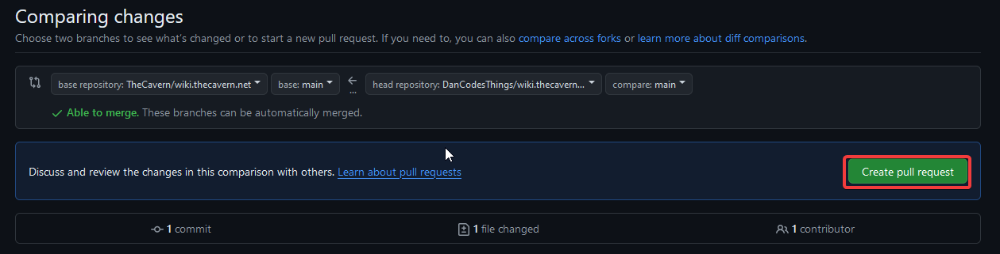
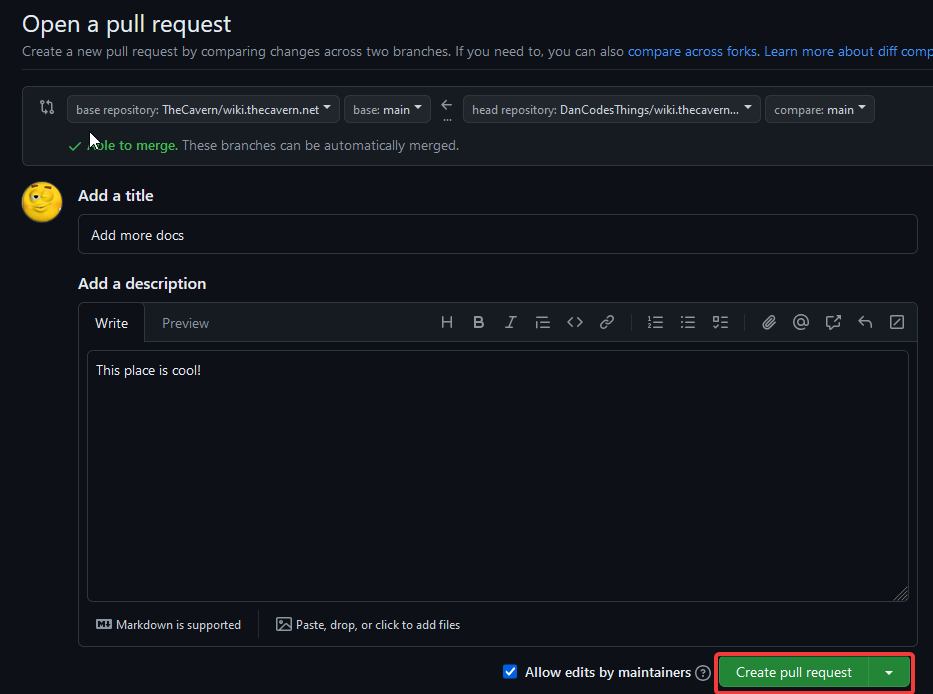

# Contributing

:::info

Go to the [GitHub](https://github.com/TheCavern/wiki.thecavern.net) to start contributing!

:::

---

## Starting Out

At the GitHub page linked at the top of this page, sign in and create your own fork of the project by clicking the "Fork" button.


Using [Markdown](https://docusaurus.io/docs/markdown-features) write the documentation you wish to be added.
Once you've made the changes in your editor (I suggest using [Visual Studio Code](https://code.visualstudio.com/)) you must commit the changes to GitHub.

If you are not familiar with GitHub, download [GitHub Desktop](https://desktop.github.com/download/), documentation for it can be found [here](https://docs.github.com/en/desktop).

Optionally, you can navigate to the directory which you have made changes in both on GitHub and your file explorer, and upload the changed files.



A proper commit should look something like this.


---

After this, you can click the commit button, and your changes should be uploaded to your fork.

To submit changes to the wiki, navigate to the "Pull Requests" button at the top of your repo's page.
Click the "New pull request" button followed by the "Create pull request" button, and fill out the fields describing your changes.




After following these steps, a new pull request will be made on the main repo, allowing others to review, comment on, and suggest changes.

---

## Structure

Docs are stored in the docs folder (duh). Categories will be a directory with a lowercase name.
Sections within these categories will be formatted with an uppercase at the start of each word with dashes replacing spaces.

Images are stored in docs/assets/img/, all image names are lowercase with underscores replacing all spaces.

```text
docs
├── assets
│   └── img
│       ├── category
│       │   └── Category-Section
│       │       ├── img_1.png
│       │       └── img_1.png
│       └── Main-Category
│           ├── img_1.png
│           └── img_1.png
├── category
│   ├── _category_.json
│   └── Category-Section.md
└── intro.md
```

---

## Standards

I hate laying out standards, so to keep it short. Use markdown where possible, avoid using JSX.

As the documentation grows, this section will become more detailed.