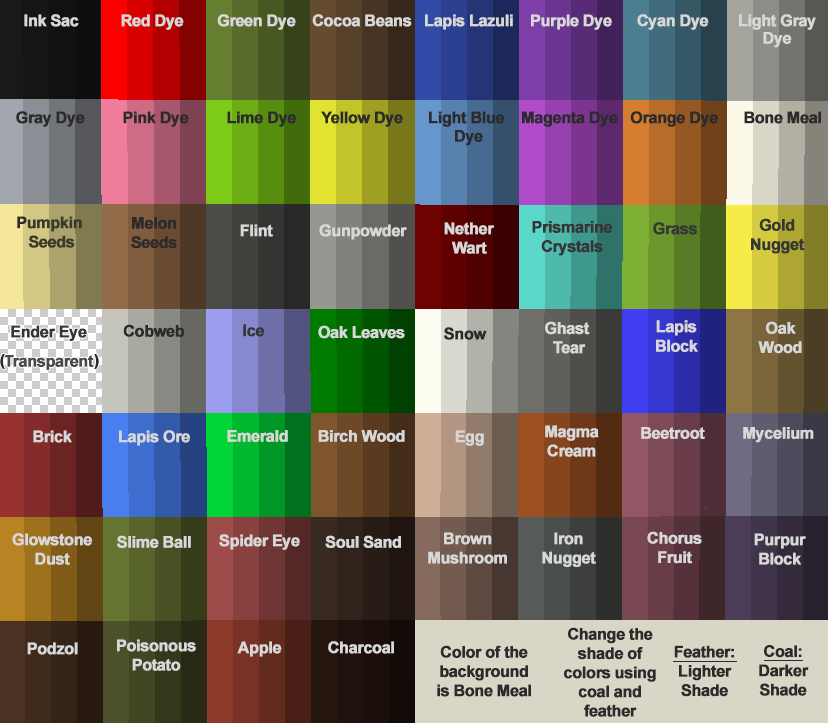

# ArtMap

  

ArtMap is a plugin that lets you create artworks in a form of minecraft map easily. Rather than building a large area to create an artwork in the server, ArtMap lets you edit out a 32x32 pixel map without building any form of structure.

:::info
To access this plugin, you need to be at least a Citizen rank.
:::

## Plugin Commands

|Command|Uses|
|-|-|
|`/art`| Open the ArtMap menu|
|`/art save`| Saves the art you are currently editing|
|`/art searh <title>`| Search art based on the title|
|`/art search --mine [title]`| Search art that you made|
|`/art search --player <playername> [title]`| Search a given player|
|`/art preview <artwork>`| Preview an artwork.|
|`/art delete <artwork>`| Deletes your artwork. All copies of this artwork will also be deleted|

## Plugin Usage

### Creating an artwork
To create an artwork, first you must get an easel and a canvas. Easel are used to place the canvas that are needed when painting. After u placed an easel, place a canvas in it so you can start painting.

Right click an easel to ride it so you know you are in **editing mode**. In this mode you cant move and you can edit the canvas you are editing in the easel. To start painting colors, you click the canvas with a dye that are listed as paint. You can see the list of dye in the [Dye section](#dyes).

When you are in editing mode, here are some items  that you  can use to edit the painting:
1. **Dyes**, left click a canvas to draw a pixel, and right click to draw a line.
2. **Fill**(Empty Bucket), left click when you have a dye in your offhand and an empty bucket in your mainhand to fill an area, right click to undo last fill   
3. **Shade**(Coal), left click a canvas to darken a pixel, and right click to draw a line. You could darken a color twice.
4. **Tint**(Feather), left click a canvas to lighten a pixel, and right click to draw a line. you can only lighten a color 1 time.
5. **Rotate**(Compass), when clicked on a canvas, it will flip the whole canvas. left click to flip horizontally, right click to flip vertically.
6. **Copy**(Sponge), left click in the canvas when editing to get a color, then you could paint with that color using right click

### Managing artworks
#### - Saving
You can save any artwork by using /artmap save . You can view artworks created by any player by opening the /artmap menu, clicking "View Artworks", and selecting the player you want to view. Even if you lose all copies of your artwork, it can still be retrieved by players with artmap.admin privileges through this menu.

#### - Copying
To create copies of an artwork, combine it in the crafting table with one or more empty map(s). Note that you can only create copies of your own artworks.
As of version 3.3.0, players may obtain artwork from the /art menu
if the player has an empty map in their inventory, clicks on the painting to copy, and right clicks on the map in that menu.

#### - Editing
To edit an artwork, right-click an easel with a copy of your artwork. Note that this won't change active copies of the original artwork, but instead creates a new artwork, identical to your original.

#### - Deleting
Any artwork can be deleted using /artmap delete . This will affect all copies in the world of this artwork. Players can only delete their own artworks, unless they have artmap.admin privileges.

#### - Obtaining / Searching
In 1.13+ versions, players may use the /art search feature. Type "/art search " to find artworks which contain the search words. For example, if I want to search for "flower" I would type "/art search flower" and hit enter. Players with permission to obtain the art can click on the text to interact with the list.

### Dyes
Here are the list of colors that you can get from the 

|Color Code|Dye|Modifier|
|-|-|-|
|#191919|InkSac|Tinted|
|#151515|InkSac||
|#111111|InkSac|1xShade|
|#0d0d0d|InkSac|2xShade|
|#fc0000|RedDye|Tinted|
|#d90000|RedDye||
|#b20000|RedDye|1xShade|
|#850000|RedDye|2xShade|
|#657d32|GreenDye|Tinted|
|#576c2b|GreenDye||
|#475824|GreenDye|1xShade|
|#35421b|GreenDye|2xShade|
|#654b32|CocoaBeans|Tinted|
|#57402b|CocoaBeans||
|#473424|CocoaBeans|1xShade|
|#35271b|CocoaBeans|2xShade|
|#324bb0|LapisLazuli|Tinted|
|#2b4097|LapisLazuli||
|#24347c|LapisLazuli|1xShade|
|#1b275d|LapisLazuli|2xShade|
|#7d3eb0|PurpleDye|Tinted|
|#6c3597|PurpleDye||
|#582b7c|PurpleDye|1xShade|
|#42215d|PurpleDye|2xShade|
|#4b7d97|CyanDye|Tinted|
|#406c82|CyanDye||
|#34586b|CyanDye|1xShade|
|#274250|CyanDye|2xShade|
|#a5a5a5|LightGrayDye|Tinted|
|#8e8e8e|LightGrayDye||
|#747474|LightGrayDye|1xShade|
|#575757|LightGrayDye|2xShade|
|#a2a6b6|GrayDye|Tinted|
|#8b8e9c|GrayDye||
|#72757f|GrayDye|1xShade|
|#555760|GrayDye|2xShade|
|#ef7da3|PinkDye|Tinted|
|#ce6c8c|PinkDye||
|#a85873|PinkDye|1xShade|
|#7e4256|PinkDye|2xShade|
|#7dca19|LimeDye|Tinted|
|#6cae15|LimeDye||
|#588e11|LimeDye|1xShade|
|#426b0d|LimeDye|2xShade|
|#e2e232|YellowDye|Tinted|
|#c3c32b|YellowDye||
|#9f9f24|YellowDye|1xShade|
|#78781b|YellowDye|2xShade|
|#6597d5|LightBlueDye|Tinted|
|#5782b8|LightBlueDye||
|#476b96|LightBlueDye|1xShade|
|#355071|LightBlueDye|2xShade|
|#b04bd5|MagentaDye|Tinted|
|#9740b8|MagentaDye||
|#7c3496|MagentaDye|1xShade|
|#5d2771|MagentaDye|2xShade|
|#d57d32|OrangeDye|Tinted|
|#b86c2b|OrangeDye||
|#965824|OrangeDye|1xShade|
|#71421b|OrangeDye|2xShade|
|#fcf9f2|BoneMeal|Tinted|
|#d9d6d0|BoneMeal||
|#b2afaa|BoneMeal|1xShade|
|#85837f|BoneMeal|2xShade|
|#f4e6a1|PumpkinSeed|Tinted|
|#d2c78a|PumpkinSeed||
|#aca272|PumpkinSeed|1xShade|
|#807a55|PumpkinSeed|2xShade|
|#956c4c|MelonSeeds|Tinted|
|#805d41|MelonSeeds||
|#694b35|MelonSeeds|1xShade|
|#4e3827|MelonSeeds|2xShade|
|#4b4b4b|Flint|Tinted|
|#404040|Flint||
|#343434|Flint|1xShade|
|#272727|Flint|2xShade|
|#979797|Gunpowder|Tinted|
|#828282|Gunpowder||
|#6b6b6b|Gunpowder|1xShade|
|#505050|Gunpowder|2xShade|
|#6f0200|NetherWart|Tinted|
|#5f0100|NetherWart||
|#4e0100|NetherWart|1xShade|
|#3a0100|NetherWart|2xShade|
|#5bd8d2|PrismarineCrystals|Tinted|
|#4ebab5|PrismarineCrystals||
|#3f9894|PrismarineCrystals|1xShade|
|#2f726f|PrismarineCrystals|2xShade|
|#7db037|Grass|Tinted|
|#6c972f|Grass||
|#587c27|Grass|1xShade|
|#425d1d|Grass|2xShade|
|#f7eb4c|GoldNugget|Tinted|
|#d4cb41|GoldNugget||
|#aea635|GoldNugget|1xShade|
|#827d27|GoldNugget|2xShade|
|#c5c5c5|Cobweb|Tinted|
|#a9a9a9|Cobweb||
|#8a8a8a|Cobweb|1xShade|
|#686868|Cobweb|2xShade|
|#9e9efc|Ice|Tinted|
|#8888d9|Ice||
|#6f6fb2|Ice|1xShade|
|#535385|Ice|2xShade|
|#007b00|OakLeaves|Tinted|
|#006900|OakLeaves||
|#005600|OakLeaves|1xShade|
|#004000|OakLeaves|2xShade|
|#fcfcfc|Snow|Tinted|
|#d9d9d9|Snow||
|#b2b2b2|Snow|1xShade|
|#858585|Snow|2xShade|
|#6f6f6f|GhastTear|Tinted|
|#5f5f5f|GhastTear||
|#4e4e4e|GhastTear|1xShade|
|#3a3a3a|GhastTear|2xShade|
|#3f3ffc|LapisBlock|Tinted|
|#3636d9|LapisBlock||
|#2c2cb2|LapisBlock|1xShade|
|#212185|LapisBlock|2xShade|
|#8d7647|DarkOakLog|Tinted|
|#7a653d|DarkOakLog||
|#635331|DarkOakLog|1xShade|
|#4a3e26|DarkOakLog|2xShade|
|#973232|Brick|Tinted|
|#822b2b|Brick||
|#6b2424|Brick|1xShade|
|#501b1b|Brick|2xShade|
|#497efc|LapisLazuliOre|Tinted|
|#3e6dd9|LapisLazuliOre||
|#3359b2|LapisLazuliOre|1xShade|
|#274285|LapisLazuliOre|2xShade|
|#00d639|Emerald|Tinted|
|#00b931|Emerald||
|#009727|Emerald|1xShade|
|#00711e|Emerald|2xShade|
|#7f5530|BirchWood|Tinted|
|#6e4929|BirchWood||
|#5a3b22|BirchWood|1xShade|
|#432c19|BirchWood|2xShade|
|#cfaf9f|Egg|Tinted|
|#b29688|Egg||
|#917b70|Egg|1xShade|
|#5d5c54|Egg|2xShade|
|#9d5124|MagmaCream|Tinted|
|#87451f|MagmaCream||
|#6f3819|MagmaCream|1xShade|
|#532a13|MagmaCream|2xShade|
|#93566b|Beetroot|Tinted|
|#7e4a5c|Beetroot||
|#683c4b|Beetroot|1xShade|
|#4d2d38|Beetroot|2xShade|
|#6f6b88|Mycelium|Tinted|
|#5f5c76|Mycelium||
|#4e4b60|Mycelium|1xShade|
|#3a3848|Mycelium|2xShade|
|#b88324|GlowstoneDust|Tinted|
|#9e711f|GlowstoneDust||
|#815c19|GlowstoneDust|1xShade|
|#614513|GlowstoneDust|2xShade|
|#667434|Slime|Tinted|
|#57632c|Slime||
|#475125|Slime|1xShade|
|#353c1c|Slime|2xShade|
|#9e4c4d|SpiderEye|Tinted|
|#884142|SpiderEye||
|#6f3536|SpiderEye|1xShade|
|#532728|SpiderEye|2xShade|
|#382823|SoulSand|Tinted|
|#30231e|SoulSand||
|#271c18|SoulSand|1xShade|
|#1e1512|SoulSand|2xShade|
|#856a61|BrownMushroom|Tinted|
|#735b53|BrownMushroom||
|#5e4a44|BrownMushroom|1xShade|
|#463732|BrownMushroom|2xShade|
|#565b5b|IronNugget|Tinted|
|#4e4e4e|IronNugget||
|#3c3f3f|IronNugget|1xShade|
|#2d2f2f|IronNugget|2xShade|
|#794857|ChorusFruit|Tinted|
|#683d4a|ChorusFruit||
|#55323d|ChorusFruit|1xShade|
|#3f262d|ChorusFruit|2xShade|
|#4b3d5b|PurpurBlock|Tinted|
|#40344e|PurpurBlock||
|#342a3f|PurpurBlock|1xShade|
|#27202f|PurpurBlock|2xShade|
|#4b3123|Podzol|Tinted|
|#402a1e|Podzol||
|#342318|Podzol|1xShade|
|#271a12|Podzol|2xShade|
|#4b5129|PoisonousPotato|Tinted|
|#404524|PoisonousPotato||
|#34381d|PoisonousPotato|1xShade|
|#272a16|PoisonousPotato|2xShade|
|#8c3b2d|Apple|Tinted|
|#793227|Apple||
|#632920|Apple|1xShade|
|#4a1f18|Apple|2xShade|
|#251610|Charcoal|Tinted|
|#1f120d|Charcoal||
|#1a0f0b|Charcoal|1xShade|
|#130b08|Charcoal|2xShade|
|#bb2f30|CrimsonNylium|Tinted|
|#a12829|CrimsonNylium||
|#832122|CrimsonNylium|1xShade|
|#631919|CrimsonNylium|2xShade|
|#923e60|CrimsonStem|Tinted|
|#7d3552|CrimsonStem||
|#672b43|CrimsonStem|1xShade|
|#4d2132|CrimsonStem|2xShade|
|#5b191d|CrimsonHyphae|Tinted|
|#4e1519|CrimsonHyphae||
|#3f1114|CrimsonHyphae|1xShade|
|#2f0d0f|CrimsonHyphae|2xShade|
|#167d84|WarpedNylium|Tinted|
|#126b72|WarpedNylium||
|#0f575d|WarpedNylium|1xShade|
|#0b4145|WarpedNylium|2xShade|
|#398c8a|WarpedStem|Tinted|
|#317977|WarpedStem||
|#276361|WarpedStem|1xShade|
|#1e4a49|WarpedStem|2xShade|
|#552b3d|WarpedHyphae|Tinted|
|#492534|WarpedHyphae||
|#3b1f2a|WarpedHyphae|1xShade|
|#2c1720|WarpedHyphae|2xShade|
|#14b283|WarpedWartBlock|Tinted|
|#119971|WarpedWartBlock||
|#0e7d5c|WarpedWartBlock|1xShade|
|#0a5e45|WarpedWartBlock|2xShade|
|#636363|CobbledDeepslate|Tinted|
|#555555|CobbledDeepslate||
|#454545|CobbledDeepslate|1xShade|
|#333333|CobbledDeepslate|2xShade|
|#d5ad91|RawIron|Tinted|
|#b8947d|RawIron||
|#967a66|RawIron|1xShade|
|#715b4c|RawIron|2xShade|
|#7da59a|GlowLichen|Tinted|
|#6c8e7f|GlowLichen||
|#587468|GlowLichen|1xShade|
|#42574e|GlowLichen|2xShade|

* csv version of the table can be accessed [here](/files/Cavern_Art_Pallatewith_tinted__shaded_colors.csv)

Here's the chart of what the colors look like:

## References
1. [Plugin Source Code](https://gitlab.com/BlockStack/ArtMap)
2. [Plugin Official Wiki](https://gitlab.com/BlockStack/ArtMap/-/wikis/home)