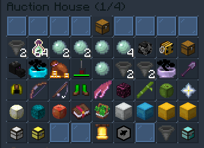

# Auction House

The auction house is a place players can list items for sale. The amount of items you can list at a given time depends on your rank.

## Listing an Item
To list an item you first need to have the **Merchant Rank**. This can be obtained by doing `/rankup` twice, for a total of **$55,000**.

Once you are at Merchant rank, do the following:

1. While holding the item run `/ah sell`
2. Type the price in chat. 

## Removing a Listed Item

1. Run `/ah`
2. Click the **Your Items** button in the bottom right.
3. Click the item you wish to remove.

## Max Listings Per Rank

| Rank  | Max Listings |
| ------------- |:-------------:|
| Newcomer   | 0 | 
| Citizen    | 0 |
| Merchant   | 2 |
| Clerk      | 2 |
| Novice     | 3 |
| Apprentice | 3 |
| Squire     | 5 |
| Viscount/Viscountess*   | 8 |
| Duke/Duchess* | 15 |
| King/Queen* | 20 |
**Requires [store](https://thecavern.net/store) purchase*

## Purchasing Items
To purchase something from a shop, do the following:

1. Click the item you wish to buy
2. Confirm/Deny the Purchase
3. Click the **Purchased Items** button
4. Claim the purchased item

You can click the buttons in the bottom middle to switch pages.
Click the hopper in the bottom right to change how the items are sorted.

## Claiming Money
When someone purchases your item, it is stored in your auction house wallet.
To claim this money, run `/ah claim`. You will also be given a notification when you join if someone has bought one of your items.

## Recovering Expired Items
Items are listed on the auction house for **3 days** before they are taken down.
You then have **14 days** to recover the item, before it is gone forever.

1. Click the **Expired Items** button
2. Click the item you wish to recover

------

## Comands Overview
| Command | Description | 
| ------------- |:-------------:|
| /ah sell [price] | List a new item |
| /ah | Open the auction house |
| /ah claim | Claim money made from the auction house |
| /ah history | View your sales history |
