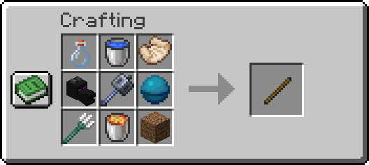
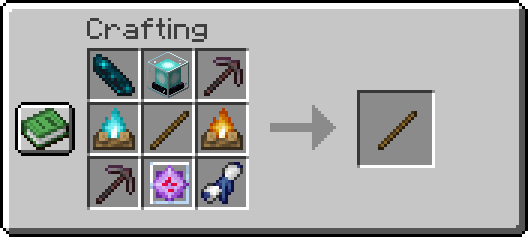
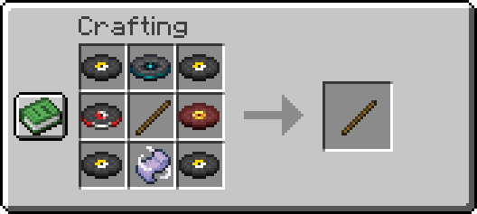

# Cavern Items

## Builder's Wand

The builder's wand is a special item that allows the user to build out platforms and patterns of blocks and cut down time on building.
The wand produces a preview of glowing blocks that when the wand is right-clicked will place the blocks and remove them from your inventory.

:::info
Unlike the original builder's wand, these have a max durability. 1 use of the wand takes 1 durability, and follows a similar damage formula when unbreaking is applied to the item.
:::

### How It Works

* Hold the wand in your main hand and aim at a block, if you're within 10 blocks and the block is a valid type, a preview of glowing blocks appears showing every spot the wand will place a matching block.
* The wand searches for connected blocks of the same type along the face you're looking at (e.g. aiming at the top of a block searches the surrounding floor), up to your wand's block limit.
* `Right-click` to place the blocks shown in the preview. The required blocks are removed from your inventory - if you don't have enough, nothing is placed, and you'll be told what's missing.
* Slabs and other directional blocks (stairs, logs, etc.) are placed matching the orientation of the block you're aiming at.
* In **Creative mode**, placing blocks doesn't consume your inventory or the wand's durability.
* `Shift + Right-click` opens the wand's configuration menu, letting you customize the preview based on your wand's tier (see the table below).

### Known Limitations

The following blocks are banned from being used with the wand

* Chests
* Trapped Chests
* Doors
* Shulker Boxes
* Skulls
* All Slimefun blocks
* All MoFood™ blocks

### Wand Limits per level

| Tier          | Outline            | Outline                                              | Block Limit | Durability           |
| ------------- | ------------------ | ---------------------------------------------------- | ----------- | -------------------- |
| Tier I (base) | Glass Block        | White Glow                                           | 32 block    | 100 Base Durability  |
| Tier II       | Glass Block        | Selectable Glow                                      | 64 block    | 500 Base Durability  |
| Tier III      | Customizable Block | Customizable Glow [hex](https://htmlcolorcodes.com/) | 160 block   | 1000 Base Durability |

### Obtaining Builder's Wand

#### A Peculiar Device (base) - Tier I

The base builder's wand is obtained via crafting using diverse items obtained from around various dimensions. Here are the ingredients you need to make one:

* Glass Bottle (Empty)
* Water Bucket
* *The Beginning of Creativity*
* Dragon Age
* Mace
* Heart of the Sea
* Trident
* Lava Bucket
* Dirt

To obtain **The Beginning of Creativity** You can loot the following structure:

| Source                                                       | Percentage |
| ------------------------------------------------------------ | ---------- |
| [Village Blacksmith Chest](https://minecraft.wiki/w/Village) | 100%       |
| [Bastion](https://minecraft.wiki/w/Bastion)                  | 35%        |

#### Suspicious Placement Wand - Tier II

The tier 2 builder's wand is obtained via crafting using diverse items obtained from around various dimensions. Here are the ingredients you need to make one:

* Echosium Isotope
* Beacon
* Upgraded Explosive Pickaxe (Netherite)
* Soul Campfire
* Campfire
* Paxel (Netherite)
* End Crystal
* *A Hurdle of Greatness*
* A Peculiar Device (Tier I Builder's Wand/Base)

To obtain **A Hurdle of Greatness** You can loot the following structure:

| Source                                                     | Percentage |
| ---------------------------------------------------------- | ---------- |
| [Rare Trial Rward](https://minecraft.wiki/w/Trial_Chamber) | 35%        |
| [End City Treasure](https://minecraft.wiki/w/End_City)     | 35%        |

#### True Builder's Wand - Tier III

The tier 3 builder's wand is obtained via crafting using music disc. Here are the ingredients you need to make one:

* 4 Any of the Music Discs
* Music Disc 5
* Music Disc Lava Chicken
* Music Disc Pigstep
* *The Sound of Music*
* Suspicious Placement Wand (Tier II Builder's Wand)

To obtain **The Sound of Music** You can loot the following structure:

| Source                                                         | Percentage |
| -------------------------------------------------------------- | ---------- |
| [Wandering Trader](https://minecraft.wiki/w/Wandering_Trader)  | 100%       |
| [Suspicious Sand/Gravel](https://minecraft.wiki/w/Archaeology) | 10%        |

### F.A.Q

> What about the old wand that people purchased from admin shop?

*When that wand is Shift+Right Clicked, it will auto convert to a new Level 2 Unbreaking V builder's wand.*

> Where is the information about the other wands?

*We'd like people to explore the information available to them with the wands and let earlier hunters figure it out before we publish all the information.*

> Is it supposed to be a stick?

*We're waiting for the model to be fully complete.* **#JustDragonThings**

## Shrinking Device (Size-Inator)

The Shrinking Device, also known as the **Size-Inator**, is a special item that lets you change your player size on the fly. You can configure the size of it by opening the menu using `Shift+Right-click` and pick the size you'd like to be, and Right-clicking toggles between your normal size and the selected size.

:::info
Like the builder's wand, the Size-Inator has a max durability, takes 1 damage per use following the same unbreaking-based damage formula, and can be repaired in a furnace.
:::

### How It Works

* `Shift + Right-click` opens the Size-Inator menu, where you can choose the size you want to shrink or grow to.
* `Right-click`:
  * If you're currently shrunk/grown, this returns you to your normal size.
  * Otherwise, it resizes you to the size selected in the menu.

### Region Restrictions

Shrinking and growing can be restricted by region:

* If WorldGuard does not allow shrinking in your current area, you'll be told you aren't allowed to shrink there.
* On Towny worlds, plot/town settings can also block resizing (you can use `/t toggle shrinking on/off` or `/plot toggle shrinking on/off`) if resizing isn't permitted in that area, you'll get an error and the device won't activate.

:::warning
If you enter a town that disallow shrinking, you will be reverted into your normal size.
:::

### Repairing the Size-Inator

The Size-Inator can be repaired in a furnace.... (duh). Place it in the smelting slot along with one of the fuels below. Each item of fuel consumed restores the listed amount of durability.

| Fuel            | Durability Restored |
| --------------- | ------------------- |
| Coal / Charcoal | 1                   |
| Blaze Rod       | 2                   |
| Coal Block      | 10                  |
| Lava Bucket     | 12                  |
