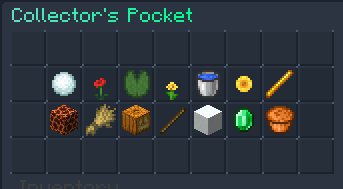
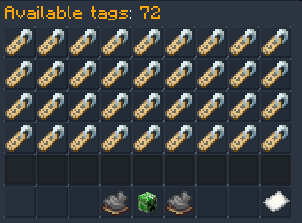
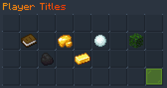

# Tags and Titles

On our server, we have chat and player cosmetics called Tags and Titles. Tags are icons which appear next to your name in chat and your name in 3rd person. Titles appear under your name in 3rd person.

## Obtaining Tags and Titles
There are numerous ways you can obtain tags and titles, each ranging in difficulty.

### Item Collector
The most common way to obtain a tag or title is through the Item Collector. Each month, a new set of collector items are added to the Vote Crate.
If you collect all 9 for that month, you can redeem the items in `/itemcollector (/ic)`. You can also redeem older months by purchasing the items from players.

### Rare Crate
In the rare crate, there are 3 exclusive Tags you can obtain. The Skull, Anchor, and YinYang. These tags have a **2.778%** chance of being obtained from the rare crate. You can also buy these from
other players selling them.

### Seasonal Crates
Occasionally, some crates will have milestones, with one of the milestones being a tag or title. To obtain this tag or title, you will need to open the crate a certain amount of times to unlock it. 
These items **cannot** be purchased from other players, however you **can** purchase the crate keys to unlock the milestone. This amount is displayed on the milestone.

### Events
Tags and Titles are also obtainable from events. Depending on the event, you may receive the **Event Winner** tag. This tag has 3 stages, and all 3 are unlocked by winning X amount of events.
Some events have exclusive tags and titles only obtainable from that specific event.

### Donating
By becoming a server, you are able to unlock some exclusive titles and tags.

### Login Rewards
Occasionally, tags and titles are available through login rewards. To redeem these, simply login!

### Server Teams
By joining one of the server teams (Build, Event, Developer) you are given an exclusive tag which you can display next to your name. This tag is also displayed next to you in tab.

## Equiping Tags and Titles
To equip a tag:

1. Run `/tags`
2. Find the tag you want to equip
3. Left click the tag

To equip a title:

1. Run `/titles`
2. Find the title you want to equip
3. Left click the title
**Important:** Make sure you have titles enabled by clicking the glass pane in the bottom right.

To view all the tags and titles you currently own, use the following:

* `/tags`
* `/titles`
