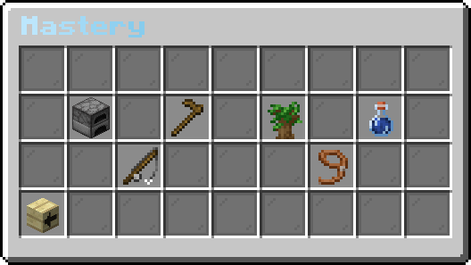

# Mastery
At the center of mofood, there is something called Mastery. Mastery is the main leveling system in MoFood. A lot of features and items in MoFood are locked behind a mastery level requirement, so it is one of the core gameplay in MoFood to level up your mastery.

Currently, there are 6 type of mastery in mofood. Each of the mastery have its own diffrent way of leveling up and gameplay. Each of them are explained on their own section.

- [Cooking](/plugins/mofood/cooking)
- [Gardening](/plugins/mofood/gardening)
- [Forestry](/plugins/mofood/forestry)
- [Brewing](/plugins/mofood/brewing)
- [Fishing](/plugins/mofood/fishing)
- [Ranching](/plugins/mofood/ranching)

:::note[Mastery Menu Navigation]
`/food` -> `Player Profile` -> `Milestone`
:::

:::warning[TO-DO]
the nontification
:::