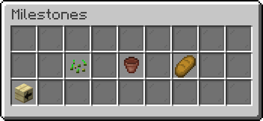
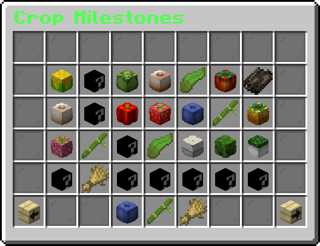

# Milestone
Milestone is a feature that rewards the player after completing a certain number of tasked repetedly. There are three types of milestone you can get in mofood: Farming, Bonsai, and Cooking milestone. Each category have its own levels, and once you reached that level, you will get the corresponding money and noms.

:::note[Milestone Menu Navigation]
`/food` -> `Player Profile` -> `Milestone`
:::

## Farming Milestone
For each crop that you can plant in MoFood, there is a milestone for that crop. In this category, milestone are based on how many of that crop have you harvested.

|Level|Count|Money|Noms|
|-|-|-|-|
|I|100|-|-|
|II|250|6000|2000|
|III|750|9000|3000|
|IV|2500|12000|4000|
|V|3500|15000|5000|
|VI|5000|18000|6000|
|VII|10000|21000|7000|
|VIII|12500|24000|8000|
|IX|15000|27000|9000|
|X|20000|30000|10000|
|XI|25000|33000|11000|
|XII|50000|36000|12000|
|XiII|100000|39000|13000|

## Tree Milestone
For Tree Milestone, for each bonsai in MoFood, there will be a corresponding milestone tied into it. Milestone are based on how many of that bonsai you have harvested.
|Level|Count|Money|Noms|
|-|-|-|-|
|I|10|500|500|
|II|25|1000|1000|
|III|50|1500|1500|
|IV|100|2000|2000|
|V|250|25000|25000|

## Cooking Milestone
Just like the previous two, for each cooking ingredient there is, there will be a corresponding milestone tied to it. This milestone category is based on how many of that recipe that you cooked.

:::info
Limited time food (ones that are only active on events) does not have a ,milestone, only regular foods do.
:::

|Level|Count|Money|Noms|
|-|-|-|-|
|I|10|-|-|
|II|25|200|20|
|III|50|300|30|
|IV|100|400|40|
|V|250|500|50|
|VI|500|600|60|
|VII|1000|700|70|
|VIII|2500|800|80|
|IX|5000|900|90|
|X|10000|1000|100|