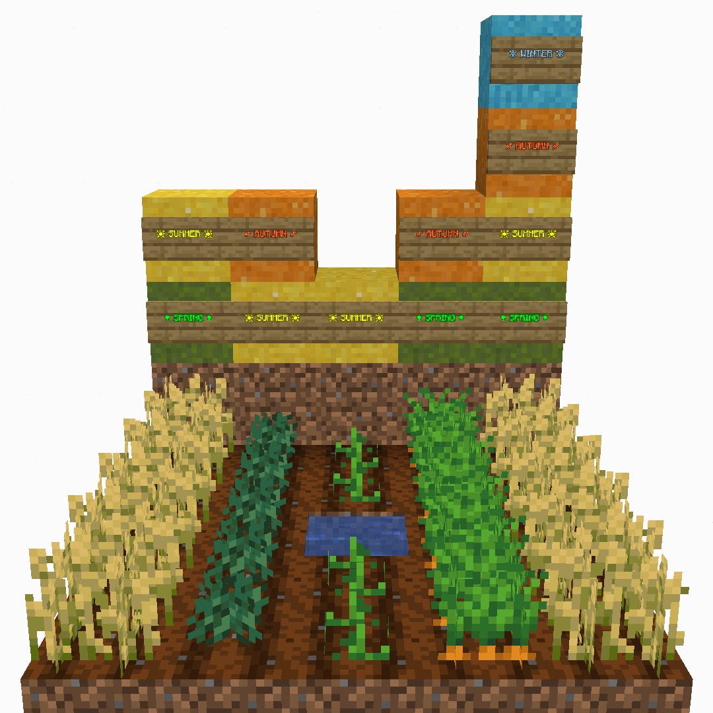
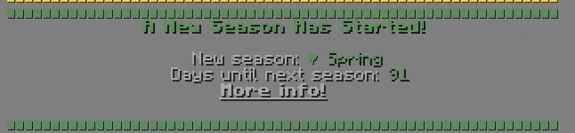

# Seasons
You may notice that some of your crops do not grow during certain periods and then suddenly thrive at other times, this is because crops in MoFood are tied to specific seasons. The plugin introduces four seasons that directly affect crop growth behavior, which is spring, summer, autumn, and winter. Some crops are restricted to a single season, while others can grow across multiple seasons, and a few are capable of growing all year-round regardless of the season.

|Name|Length (MC Days)|
|-|-|
|Spring|91|
|Summer|94|
|Autumn|91|
|Winter|89|

When entering a new season, there will be a broadcast message in chat that tells you what's the new season is. If you want to check the current season you are in, you can either locate them in `tab` menu, or open the `/food` menu.

