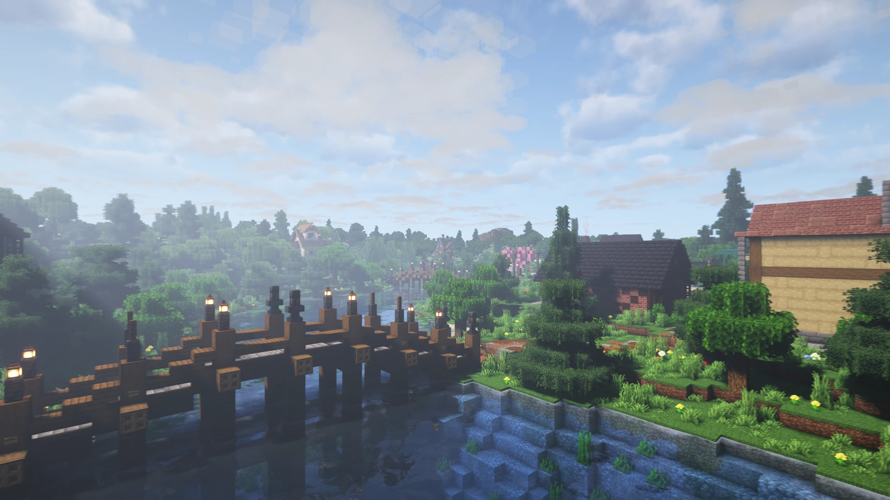
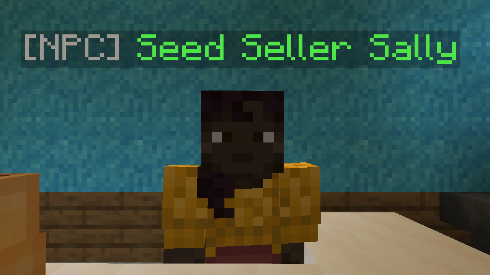
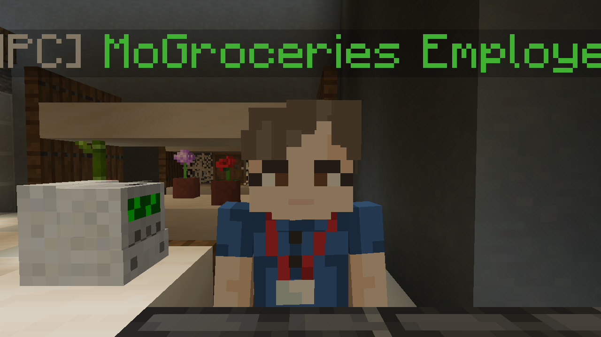
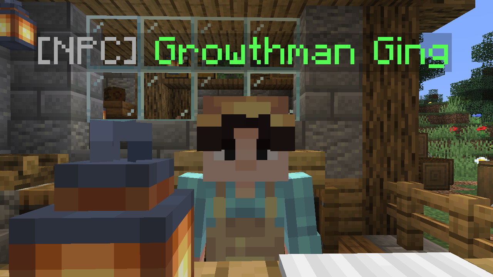
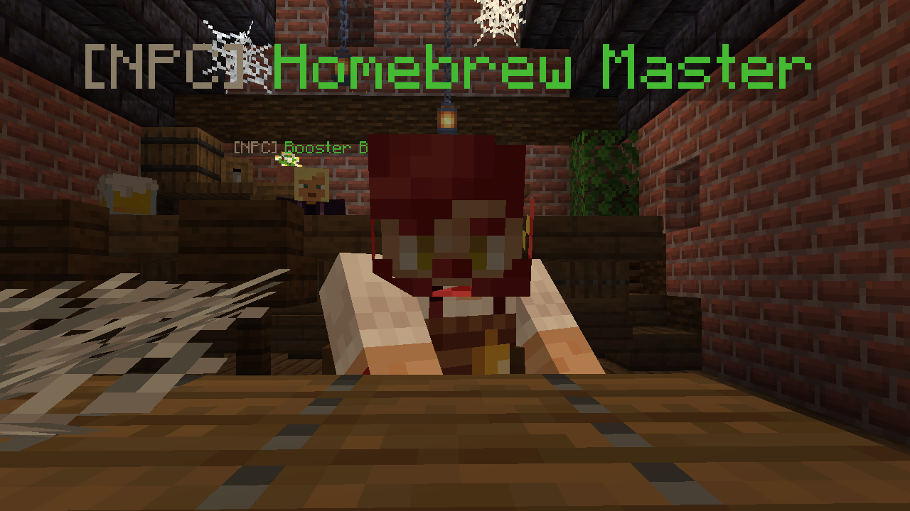
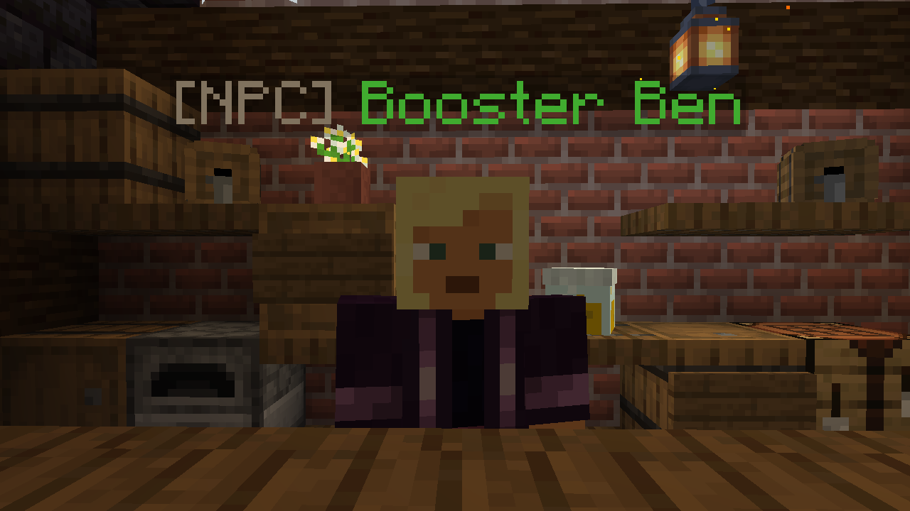
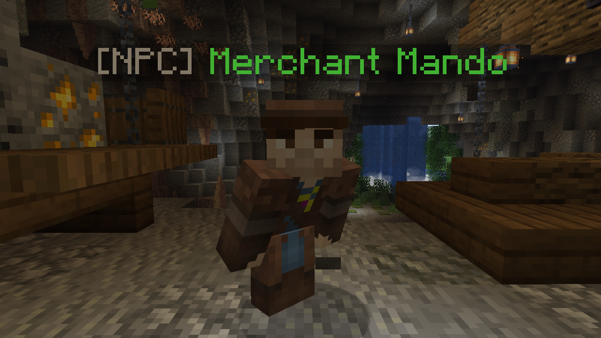
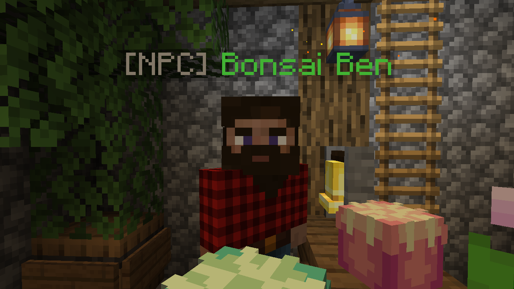

# The Town
The town is a location located in (0, 0) on mainworld. It is a server protected area of which houses a number of NPC that are scattered around the area. This area can be visited by doing `/warp town`.

## Shops
:::info
By default you purchace one at a time, but for some NPC, you can increase it by clicking the button on the button of the shop GUI
:::

### Seed Shop

|Location|
|-|
|(186 65 -2)|

Seed Seller Sally is your main source for buying seeds. You can locate her inside the light brown house with dark brown roof in front of the spawn area of The Town(in front of you and a bit to the right, after `/warp town`).

#### Inventory
As the name suggests, Sally sell seeds from the MoFood plugin. The seed she sells is based on what the current season is in. She only sells the seeds that can grow on that season. The price of a seed she sells is 5 times the required level to unlock that seed. For instance if a seed is unlocked at level 10 Gardening, then the price of that seed is 50 Noms.

### Ingredient Shop

If you ever seen an ingredient that doesn't have a recipe when cooking food, more than likely its an ingredient that can be bought from the MoGroceries Employee. The shop is a gray building with a rectangle roof across the river south of the The Town spawn(go right, after `/warp town`).

#### Inventory
|Ingredient|Price|Level Requirement|
|-|-|-|
|Salt|3|Lvl 1 Cooking|
|Pepper|1|Lvl 10 Cooking|
|Vinegar|2|Lvl 1 Cooking|
|Sprinkles|1|Lvl 20 Cooking|
|Flour|2|Lvl 20 Cooking|
|Yeast|3|Lvl 1 Cooking|
|Cream_of_tartar|10|Lvl 20 Cooking|
|Empty_bucket|3|Lvl 1 Cooking|

### Growth Shop

|Location|
|-|
|(34, 65, -9)|

Growth Shop is your one stop shop for all of your [Magical Fruit](https://wikidev.shinyshoe.net/plugins/mofood/magical_farming/magical_fruits) farming needs. In here you can buy [Growth Chamber](https://wikidev.shinyshoe.net/plugins/mofood/magical_farming/growth_chamber) and [Magical Fruit Seeds](https://wikidev.shinyshoe.net/plugins/mofood/magical_farming/magical_fruits#magical-fruit-seeds).

#### Inventory
|Wares|Price|Level Requirement|Limit|
|-|-|-|-|
|Growth Chamber|250000|Lvl 25 Gardening|5|
|Fade Apple Seed|250|Lvl 25 Gardening|-|
|Miracle Calamansi Seed|275|Lvl 30 Gardening|-|
|Ophe Fruit Seed|300|Lvl 35 Gardening|-|
|Spring Rowan Seed|325|Lvl 40 Gardening|-|
|Mountain Leek|350|Lvl 45 Gardening|-|
|Ice Pawpaw|375|Lvl 50 Gardening|-|
|Cavern Cawesh|400|Lvl 55 Gardening|-|

### Homebrew Master

|Location|
|-|
|(155, 66, 1)|

#### Inventory
|Wares|Price|Level Requirement|
|-|-|-|
|Koji Mold|20|Lvl 15 Brewing|

### Booster Shop

|Location|
|-|
|(160, 67, 0)|

#### Inventory
|Wares|Price|Level Requirement|Ingredients|Effect(s)|
|-|-|-|-|-|
|Blessed Foot|300|Lvl 70 Gardening|- 3x Mountain leek ★★ - 5x Mountain leek ★ |+4 Luck (5 Minutes)|
|Heavenly Tears|300|Lvl 70 Gardening|- 3x Miracle calamansi ★★ - 5x Miracle calamansi ★ |+4 Regeneration (5 Minutes)|
|Igneous Apple|300|Lvl 70 Gardening|- 3x Fade apple ★★ - 5x Fade apple ★ |+4 Speed (5 Minutes)|
|Flammable Roots|300|Lvl 70 Gardening|- 3x Ophe fruit ★★ - 5x Ophe fruit ★ |+4 Increase damage (5 Minutes)|
|Frozen Artifact|300|Lvl 70 Gardening|- 3x Ice pawpaw ★★ - 5x Ice pawpaw ★ |+4 Speed (5 Minutes) +5 Heal (1 Second)|
|Spelunkers Dream|300|Lvl 70 Gardening|- 3x Cavern cawesh ★★ - 5x Cavern cawesh ★ |+4 Fast digging (5 Minutes)|

### Traveling Merchant

|Location|
|-|
|(247, 70, 67)|

#### Inventory
|Wares|Price|Level Requirement|Percentage|Limit|
|-|-|-|-|-|
|COMMON_BONSAI|1000|Lvl 1 Forestry|100|-|
|UNCOMMON_BONSAI|2500|Lvl 5 Forestry|75|-|
|RARE_BONSAI|5000|Lvl 20 Forestry|50|-|
|EPIC_BONSAI|10000|Lvl 35 Forestry|25|-|
|LEGENDARY_BONSAI|50000|Lvl 50 Forestry|10|3|
|MYTHIC_BONSAI|100000|Lvl 70 Forestry|1|1|
|Quest Reroll Token|25000|Lvl 20 Gardening|50|3|
|Hoe of Tilling|100000|Lvl 20 Gardening|100|1|
|Seed Basket|100000|Lvl 20 Gardening|100|1|

### Bonsai Shop

|Location|
|-|
|(-7, 68, -108)|

#### Inventory
|Wares|Price|
|-|-|
|MoFood Composter|1000|